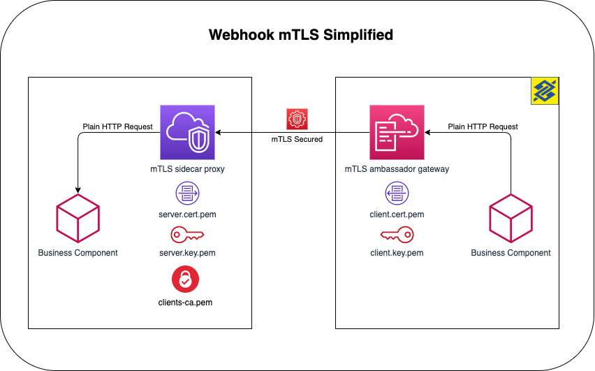

# API mTLS Ambassador Gateway (client)

Ambassador Docker container used to authenticate using mTLS for the Open Banking and PIX API communication as client (request)

## Quick Start

First, clone this repo:

```bash
git clone https://github.com/bancodobrasil/api-mtls-sidecar-proxy.git
```

Second, bring up the Ambassador:

```bash

docker-compose up --build

```

Then run `curl`:

```bash
$ curl http://localhost:9090

[{"title":"Clean kitchen","description":"Don't forget the are under the sink!!"},{"title":"Call Eric","description":"Remind him to do his taxes"},{"title":"Water flowers","description":"Don't forget the ones in the garden!"}]
```

## The whole pattern

The full pattern implemented here is the sidecar-proxy and ambassador-gateway. You can [check here](https://github.com/bancodobrasil/api-mtls-ambassador-gateway) the ambassador-gateway part.



## Bundling certificates in a Docker imagem

In the [example folder](/example) you have some instructions on how to build this ambassador bundling your certificates. Basically, you will create a Dockerfile with the following contents:

```Dockerfile
FROM bancodobrasil/api-mtls-ambassdor-gateway:0.1.0

COPY local/path/to/client.cert.pem /etc/nginx/conf.d/certs/client.cert.pem
COPY local/path/to/client.key.pem /etc/nginx/conf.d/certs/client.key.pem
COPY local/path/to/trusted_ca_cert.pem /etc/nginx/conf.d/certs/trusted_ca_cert.pem
```

This way you won't need to map any volume or define environment var. The container will be built specifically for one given client.

## External References

- https://jamielinux.com/docs/openssl-certificate-authority/create-the-root-pair.html: This guide demonstrates how to act as your own certificate authority (CA) using the OpenSSL command-line tools.
